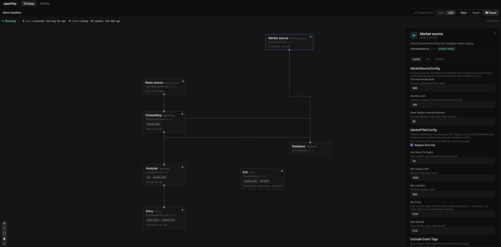
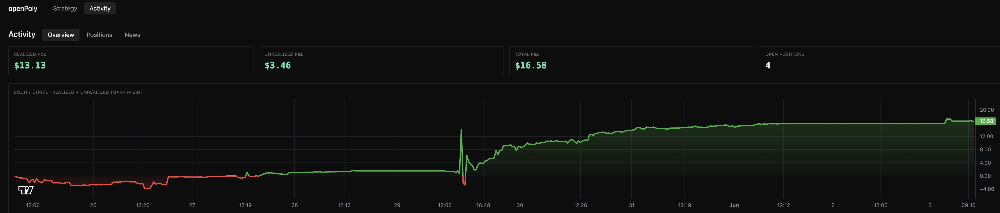

<div align="center">
  

  <h1>openPoly</h1>

  <p><b>Open, news-driven, on-chain-verifiable live trading for Polymarket.</b></p>

  <a href="https://konananachan.github.io/OpenPoly/"></a>
  <a href="./LICENSE"></a>
  
  = 20" />
  
  <br />
  <a href="https://tradingnews.press" target="_blank"></a>
  <a href="https://docs.polymarket.com" target="_blank"></a>

  <p>
    Public release, deployment, and maintenance by
    <a href="https://github.com/KoNananachan">KoNananachan</a>.
  </p>
</div>

Experimental live-trading system for [Polymarket](https://polymarket.com)
prediction markets. A single-process Python backend drives an event-driven
strategy pipeline; a React Flow canvas lets you wire that pipeline up and tune
it visually.

> ⚠️ **openPoly can place real orders with real money.** It defaults to **paper
> mode** and never touches funds until you explicitly switch to live. Prediction
> markets are high risk and restricted in many jurisdictions. Read the
> [DISCLAIMER](./DISCLAIMER.md) before going anywhere near live mode.

## See the demo first (no backend, no setup)

[](https://konananachan.github.io/OpenPoly/)

**▶ Live demo: <https://konananachan.github.io/OpenPoly/>** — the real frontend
with mock data, running entirely in your browser. Click and look around; nothing
connects to a backend and no funds are involved. All numbers, positions, and
news are **mock data**; clicking a live action (Run/Pause, save keys, …) just
pops a "demo mode" notice — nothing real happens. For the full thing with a live
paper-trading backend, use the Quickstart below.

## What it is

openPoly trades one strategy at a time at grain-scale capital ($5–$50), built to
iterate fast and validate signal alpha on real markets. The strategy decision
logic is **atomized into pluggable "sections"** — typed, swappable modules
(news source, market source, embedding, analyzer, entry, exit, …) that you can
reconfigure on the canvas without touching the framework.

It is a deliberately **single system**: one process, one pipeline, one SQLite
file — zero infra to stand up. See
[`docs/architecture/`](./docs/architecture/00-overview.md) for the design.

| Layer | Choice |
|---|---|
| Backend | Python + FastAPI, single process |
| Storage | SQLite (single writer) |
| Polymarket SDK | `py-clob-client` |
| Frontend | React + React Flow (strategy canvas) |

> **Built on external APIs.** openPoly is a thin orchestration layer over two
> third-party services: news signals come from the **TradingNews API**, and all
> market data and order placement go through the **official Polymarket API**
> (via [`py-clob-client`](https://github.com/Polymarket/py-clob-client)). It
> ships no proprietary data or matching of its own — you bring credentials for
> each service (see `.env.example`) and openPoly wires them into the pipeline.

## Features

- **Visual strategy canvas** — wire up and tune the whole decision pipeline on a
  React Flow canvas. Each node is a section; edit its config inline, no redeploy.
- **Pluggable typed sections** — the decision logic is atomized into swappable
  modules (news source, market source, embedding, analyzer, entry, exit,
  database). Each has a Pydantic `Config`, so its params are a single source of
  truth shared by backend and canvas.
- **Event-driven, single process** — one FastAPI process drives the pipeline; the
  runtime owns scheduling, capability injection, audit, and timeouts.
- **Paper mode by default** — runs against real markets with no funds at risk;
  live order placement is an explicit, deliberate opt-in.
- **Live activity monitoring** — equity curve, open positions, and the incoming
  news feed update as the strategy runs.
- **Zero hardcoded secrets** — every credential resolves via `*_ref` indirection
  (`env:` / `local:` / keychain); nothing sensitive lives in the repo.
- **Zero infra** — a single Python process and one SQLite file. Nothing to stand
  up, nothing to orchestrate.

## Early results — a first read on the signal

openPoly has run **live, on real money** on Polymarket (Polygon mainnet) at
grain scale ($1–$10 per entry). One window — 25 positions over ~6 days — is a
tiny sample, but it already says something useful about *where the edge lives*.



| Live window · 2026-05-25 → 05-31 | Result |
|---|---|
| Realized return on notional, net of fees | **+5.2%** |
| Mark-to-market return (snapshot) | +6.7% |
| Closed win rate | 62% (13 / 21) |
| Live fills / distinct positions | 46 / 25 |
| Entry notional deployed | $229.42 |
| On-chain settlement | 39 / 40 receipts `0x1` |

**Every entry (25/25) was triggered by an incoming news item** — openPoly never
trades on price alone. And after those news-triggered entries, **23 of 25
positions moved in the trade's favor** before exit, several sharply (post-entry
peaks of +67%, +80%, +142%, +161% against entry price). The news, in other
words, tended to arrive *ahead* of the market repricing. That is where the edge
appears to live — in the **news signal itself** (streamed in via the TradingNews
API), not in anything clever downstream.

The realized number is deliberately modest next to those peaks, and that gap is
the honest takeaway: the *signal* found the move; the *exit logic* gave most of
it back (one position peaked +161% but booked +$1.68; another ran +142% then
stopped out at −$2.90). Closed win rate was 13/21.

> A tiny, early sample (n=25) on grain-scale capital — **suggestive** of a real
> directional edge, not a proven or repeatable return. Past results say nothing
> about the future, and openPoly is not investment advice. Read the
> [DISCLAIMER](./DISCLAIMER.md) before going near live mode.

### How a trade gets decided

`news_source → embedding → analyzer → entry → exit`, each a swappable section: a
news item arrives, the **embedding** narrows it to the markets it actually moves,
the **analyzer** scores the directional signal, **entry** fires only past an edge
threshold, and **exit** manages the position (take-profit / trailing-stop /
stop-loss).

### Where it improves next

The data points the work at *exits and sizing*, not the signal:

- **Let winners run** — trailing/stop exits surrendered large post-entry peaks;
  conviction-scaled holds would keep more of the move the signal already found.
- **Size by conviction** — flat ~$5–10 sizing treats a +161% setup like a coin
  flip; weighting by analyzer confidence concentrates capital on the strongest
  signals.
- **Tighter entries** — a few stop-losses fired on positions that peaked sharply
  in their favor first; better entry timing and slippage control would convert
  more of those into wins.

## Quickstart (paper mode, same machine)

**Prerequisites:** [`uv`](https://docs.astral.sh/uv/) (Python toolchain) and
Node.js + `yarn`.

```bash
# 1. Backend — binds 127.0.0.1:8000, paper mode by default
uv run uvicorn openpoly.api.main:app

# 2. Frontend — in another terminal, proxies to the local backend on :8000
cd frontend && yarn install && yarn dev
```

Open the Vite URL it prints and the strategy canvas loads. No environment
variables, no funds, no live orders — paper mode is the default. To configure
secrets for later, copy `.env.example` to `.env` (gitignored) and fill it in.

**Trading live from a Polymarket-geoblocked region?** Order placement is region
-blocked there, so the backend has to run from an allowed region while the
frontend stays local. See [`docs/deploy/`](./docs/deploy/README.md).

## Repo layout

```
openpoly/                Python backend
├── sections/            ← pluggable strategy sections (the main extension point)
│   ├── _base.py         ·   section contract / registry / contract-test (framework — edit with care)
│   ├── entry/ exit/     ·   trade-decision sections
│   ├── analyzer/        ·   signal analysis (e.g. LLM)
│   ├── embedding/       ·   text → vector
│   ├── news_source/     ·   ← section impl (≠ openpoly/news/)
│   ├── market_source/   ·   ← section impl (≠ openpoly/markets/)
│   └── database/        ·   ← section impl (≠ openpoly/db/)
├── user_sections/       ← drop your own section impls here (gitignored, runs locally)
├── api/                 FastAPI routes
├── db/                  SQLite engine + stores      (≠ sections/database/)
├── news/  markets/      domain logic                (≠ sections/*_source/)
├── execution/ wallet/   order dispatch + signing
├── portfolio/ runtime/  position store + orchestrator/monitors
├── llm/  embedding/     LLM client + embedding model
frontend/src/sections/   canvas UI, mirrors openpoly/sections/ by name
docs/architecture/       design decisions
docs/deploy/             deployment models (default same-machine + geoblock split)
tests/                   pytest suite
```

Two naming gotchas worth internalizing: `openpoly/db/` (the SQLite engine) is
**not** `sections/database/` (a swappable database *section*), and
`openpoly/news/` · `markets/` (domain logic) are **not**
`sections/news_source/` · `market_source/` (section impls).

## Extending it

Strategy work happens in **sections**. To add your own, drop a class implementing
the section contract (`SECTION_TYPE`, `SECTION_VERSION`, `REQUIRES`, `Config`,
`run`) into [`openpoly/user_sections/`](./openpoly/user_sections/README.md) — the
registry discovers it at startup. That directory is gitignored, so your private
strategies stay local. Full contract: [`docs/architecture/02-strategy-sections.md`](./docs/architecture/02-strategy-sections.md).

## Ethos

- **MIT** licensed — open source is a mindset, not a future milestone.
- **Published and maintained by KoNananachan** — this public repo is the canonical
  openPoly release.
- **Default paper mode** — live trading requires explicit opt-in.
- **Zero hardcoded secrets** — everything via `*_ref` indirection (env / keychain).
- **Cross-platform** — Linux / macOS first.

## License

[MIT](./LICENSE) © 2026 KoNananachan and openPoly contributors. No warranty — see
[DISCLAIMER](./DISCLAIMER.md).
